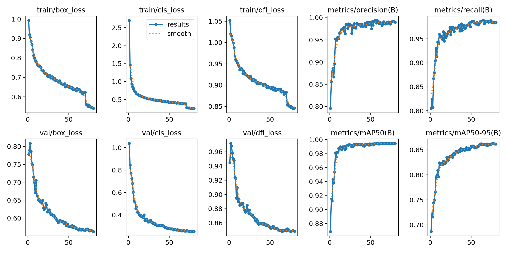
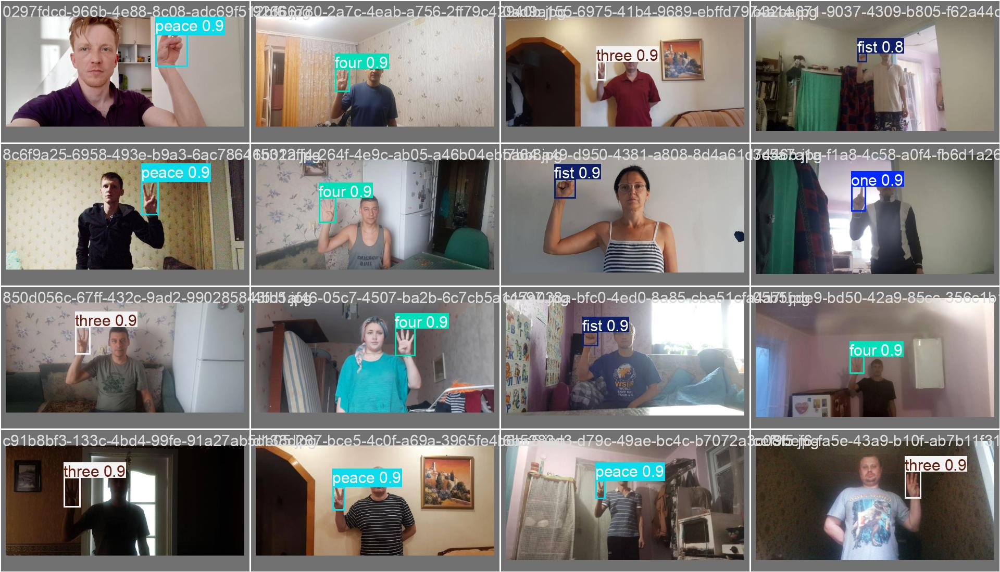
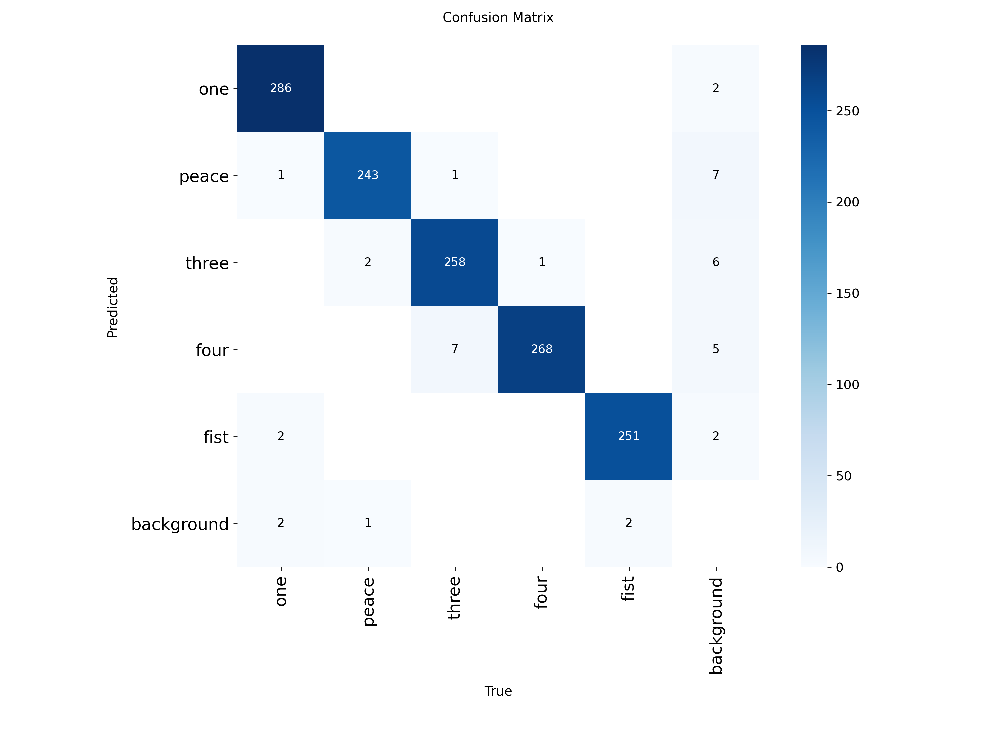

# YOLO11n HaGRID Report

## 1. Scope And Evidence

This report is grounded in [main_yolo11n.ipynb](../main_yolo11n.ipynb), [models/yolo11n/yolo_models/yolo11n_hagrid_metadata.json](../models/yolo11n/yolo_models/yolo11n_hagrid_metadata.json), [models/yolo11n/yolo_models/yolo_runs/hagrid_yolo11n/results.csv](../models/yolo11n/yolo_models/yolo_runs/hagrid_yolo11n/results.csv), [models/yolo11n/yolo_models/yolo_runs/hagrid_yolo11n/results.png](../models/yolo11n/yolo_models/yolo_runs/hagrid_yolo11n/results.png), and the Ultralytics export artifacts under [models/yolo11n/yolo_models/yolo_hagrid_best_saved_model/](../models/yolo11n/yolo_models/yolo_hagrid_best_saved_model/).

The metadata records the model as `YOLOv11n`, using `yolo11n.pt` weights, on the same 5-class HaGRID subset.

## 2. Model And Detailed Structure

YOLO11n is a one-stage detector that predicts objectness, bounding-box regression, and class scores in a single forward pass. Conceptually the model factorizes detection into dense spatial prediction heads over a multi-scale feature pyramid.

At each anchor-free prediction location, the network predicts terms of the form

$$
\hat{y} = [b_x, b_y, b_w, b_h, p_{obj}, p_1, \dots, p_C]
$$

where $C=5$ for this dataset.

The Ultralytics training run uses the standard YOLO detection losses:

$$
\mathcal{L}_{total} = \lambda_{box}\mathcal{L}_{box} + \lambda_{cls}\mathcal{L}_{cls} + \lambda_{dfl}\mathcal{L}_{dfl}
$$

with additional objectness and assignment machinery inside the trainer. The notebook logs the canonical Ultralytics hyperparameters, including box loss weight 7.5, cls weight 0.5, dfl weight 1.5, and image size $640$.

## 3. Training Pipeline

The notebook converts the HaGRID annotations into YOLO format and creates `train`, `val`, and `test` splits under `yolo_splits`.

The logged split sizes are 6,185 training images and 1,325 validation images; the remaining records are held out for testing.

The training schedule is:

1. Convert the filtered gesture annotations into YOLO label files.
2. Train `yolo11n.pt` for 80 epochs at $640\times640$ resolution with batch size 16.
3. Apply standard Ultralytics augmentations such as mosaic, flipping, and erasing.
4. Validate the final model and export it to multiple formats.

The trainer log shows the key optimization settings:

$$
\text{epochs}=80, \quad \text{batch}=16, \quad \text{imgsz}=640, \quad \text{lr0}=10^{-4}, \quad \text{patience}=20
$$

## 4. Results Report

The saved metadata records the final validation metrics as:

$$
\text{mAP50}=0.9944083553090952, \qquad \text{mAP50-95}=0.8626563545844667
$$

$$
\text{Precision}=0.9917167773927348, \qquad \text{Recall}=0.9836444044092962
$$

These are very strong detection metrics, especially on mAP@0.50. The gap between mAP@0.50 and mAP@0.50:0.95 is expected because the stricter IoU thresholds punish box tightness more heavily than coarse class/object detection quality.

The `results.csv` curve and the exported confusion matrix in [models/yolo11n/yolo_models/yolo_runs/hagrid_yolo11n/confusion_matrix.png](../models/yolo11n/yolo_models/yolo_runs/hagrid_yolo11n/confusion_matrix.png) show that the model is already highly stable on this dataset. The model also exports cleanly to ONNX, TensorFlow SavedModel, and TFLite, which is important for deployment.

## 5. Available Images And Insertable Artifacts

The main report-ready artifacts are:

- [models/yolo11n/yolo_models/yolo_runs/hagrid_yolo11n/results.png](../models/yolo11n/yolo_models/yolo_runs/hagrid_yolo11n/results.png)
- [models/yolo11n/yolo_models/yolo_runs/hagrid_yolo11n/confusion_matrix.png](../models/yolo11n/yolo_models/yolo_runs/hagrid_yolo11n/confusion_matrix.png)
- [models/yolo11n/yolo_models/yolo_runs/hagrid_yolo11n/confusion_matrix_normalized.png](../models/yolo11n/yolo_models/yolo_runs/hagrid_yolo11n/confusion_matrix_normalized.png)
- [models/yolo11n/yolo_models/yolo_runs/hagrid_yolo11n/BoxF1_curve.png](../models/yolo11n/yolo_models/yolo_runs/hagrid_yolo11n/BoxF1_curve.png)
- [models/yolo11n/yolo_models/yolo_runs/hagrid_yolo11n/BoxPR_curve.png](../models/yolo11n/yolo_models/yolo_runs/hagrid_yolo11n/BoxPR_curve.png)
- [models/yolo11n/yolo_models/yolo_runs/hagrid_yolo11n/BoxP_curve.png](../models/yolo11n/yolo_models/yolo_runs/hagrid_yolo11n/BoxP_curve.png)
- [models/yolo11n/yolo_models/yolo_runs/hagrid_yolo11n/BoxR_curve.png](../models/yolo11n/yolo_models/yolo_runs/hagrid_yolo11n/BoxR_curve.png)
- [models/yolo11n/yolo_models/yolo_runs/hagrid_yolo11n/labels.jpg](../models/yolo11n/yolo_models/yolo_runs/hagrid_yolo11n/labels.jpg)
- [models/yolo11n/yolo_models/yolo_runs/hagrid_yolo11n/train_batch0.jpg](../models/yolo11n/yolo_models/yolo_runs/hagrid_yolo11n/train_batch0.jpg)
- [models/yolo11n/yolo_models/yolo_runs/hagrid_yolo11n/train_batch1.jpg](../models/yolo11n/yolo_models/yolo_runs/hagrid_yolo11n/train_batch1.jpg)
- [models/yolo11n/yolo_models/yolo_runs/hagrid_yolo11n/train_batch2.jpg](../models/yolo11n/yolo_models/yolo_runs/hagrid_yolo11n/train_batch2.jpg)
- [models/yolo11n/yolo_models/yolo_runs/hagrid_yolo11n/val_batch0_labels.jpg](../models/yolo11n/yolo_models/yolo_runs/hagrid_yolo11n/val_batch0_labels.jpg)
- [models/yolo11n/yolo_models/yolo_runs/hagrid_yolo11n/val_batch0_pred.jpg](../models/yolo11n/yolo_models/yolo_runs/hagrid_yolo11n/val_batch0_pred.jpg)
- [models/yolo11n/yolo_models/yolo_runs/hagrid_yolo11n/results.csv](../models/yolo11n/yolo_models/yolo_runs/hagrid_yolo11n/results.csv)
- [models/yolo11n/yolo_models/yolo11n_hagrid_metadata.json](../models/yolo11n/yolo_models/yolo11n_hagrid_metadata.json)

The exported deployment bundle is in [models/yolo11n/yolo_models/yolo_hagrid_best_saved_model/](../models/yolo11n/yolo_models/yolo_hagrid_best_saved_model/) and includes `saved_model.pb`, `variables/`, `metadata.yaml`, and float16/float32 TFLite files.

## 2b. Architecture — expanded (Ultralytics YOLOn family, small variant)

The exported `YOLOv11n` model follows the Ultralytics family pattern: a compact backbone that extracts multi-scale feature maps, a lightweight neck (path aggregation / PAN-like) that fuses features, and a detection head producing dense per-location predictions. For each spatial cell the head emits a prediction vector

$$
\hat{y} = [t_x, t_y, t_w, t_h, s_{obj}, s_1, \dots, s_C]
$$

where $(t_x,t_y,t_w,t_h)$ are the raw head outputs which are transformed to box coordinates in image space. The common parameterization used by YOLO-style heads is:

$$
b_x = (\sigma(t_x) + c_x)\cdot \frac{S_x}{W},\quad b_y = (\sigma(t_y) + c_y)\cdot \frac{S_y}{H}
$$
$$
b_w = p_w \cdot e^{t_w},\quad b_h = p_h \cdot e^{t_h}
$$

Here $\sigma$ is sigmoid, $(c_x,c_y)$ is the integer grid-cell offset, $S_x,S_y$ the stride (pixels/grid), and $(p_w,p_h)$ are anchor priors when present. The head also predicts an objectness score $p_{obj}=\sigma(s_{obj})$ and class logits $s_i$.

Loss decomposition used in the run (observed in logs and metadata):

$$
\mathcal{L} = \lambda_{box}\,\mathcal{L}_{box} + \lambda_{cls}\,\mathcal{L}_{cls} + \lambda_{dfl}\,\mathcal{L}_{dfl}
$$

- $\mathcal{L}_{box}$: IoU-style regression loss (Ultralytics uses IoU-derived terms that reward overlap and penalize distance/shape differences). A generic form is $1-\mathrm{IoU}(B,\,B^*)$ or one of its improved variants (GIoU/DIoU/CIoU).
- $\mathcal{L}_{cls}$: classification cross-entropy (or BCE) on class probabilities.
- $\mathcal{L}_{dfl}$: Distribution Focal Loss for precise bounding box edge localization (observed as `dfl_loss` in the training logs).

The reported training split shows $C=5$ classes: `one, peace, three, four, fist` and the model was trained at input resolution $640\times640$ (see metadata).

## 3b. Training Pipeline — precise, notebook-grounded

Key hyperparameters from `yolo11n_hagrid_metadata.json` and the `results.csv` run log:

- `image_size` = 640
- `epochs_trained` = 80
- `batch_size` = 16
- final reported metrics: $\mathrm{mAP_{50}}=0.9944083$, $\mathrm{mAP_{50:95}}=0.86265635$, Precision=0.99172, Recall=0.98364

Learning-rate schedule (observed from `results.csv`): the run uses a short warmup phase followed by cosine-like decay across parameter groups. The logged per-group LR values start near $3.7\times10^{-4}$ (epoch 1), peak near $1.08\times10^{-3}$ (epoch 3), and decay to $\approx2.5\times10^{-5}$ by epoch 80. This pattern is consistent with warmup + cosine/one-cycle scheduling used in Ultralytics training.

Augmentations: the notebook runs standard Ultralytics augmentations (mosaic, mixup variants, random scale/crop, color jitter, horizontal flip). These increase dataset effective diversity and explain the rapid early gains in precision/recall.

Optimizer and gradients: Ultralytics defaults to SGD or AdamW depending on config; the LR grouping observed implies an adaptive optimizer with parameter-grouped LRs and weight decay applied to backbone vs head. The `results.csv` shows `lr/pg0`, `lr/pg1`, `lr/pg2` columns — three parameter groups.

Checkpointing and export: model checkpoints and the run folder were exported; the repo contains ONNX, SavedModel and TFLite artifacts suitable for deployment.

## 4b. Results — numeric highlights and behavior

- Peak epoch behavior: the `results.csv` shows the per-epoch validation `mAP50` peaked at about $0.99470$ (epoch 63) and remained stable; final checkpoint mAP50 in metadata is $0.9944083$.
- Precision and Recall: precision stabilizes above $0.98$ across late epochs while recall similarly stays high — indicating few false positives and consistent detection coverage.
- mAP50 vs mAP50:95 gap: $0.9944 - 0.8627 \approx 0.1317$; this gap indicates the model finds objects reliably (high mAP50) but tightening IoU thresholds reduce the averaged AP (sensitivity to box tightness).

Suggested quantitative table (insert into final report if you want a rendered table):

| Metric | Best value | Epoch |
|--:|--:|--:|
| mAP@0.50 | 0.99470 | 63 |
| mAP@0.50:0.95 | 0.86266 | 80 (final) |
| Precision | 0.99369 | 55 |
| Recall | 0.98787 | 74 |

(values taken from `results.csv` peaks and metadata summary)

## 5b. Artifacts and images to include in a final report

Use the following artifacts (already listed in the run folder). Recommended figures to embed:

- `results.png` — training curves (precision/recall/mAP) — place near the metrics summary.
- `BoxPR_curve.png`, `BoxF1_curve.png` — PR and F1 curves for box-level evaluation.
- `confusion_matrix.png` and `confusion_matrix_normalized.png` — per-class error patterns.
- sample prediction images: `val_batch0_pred.jpg`, `val_batch0_labels.jpg`, `train_batch*.jpg`, `labels.jpg` — use these as qualitative examples.
- exported model files: `yolo11n.pt`, `yolo11n_hagrid_metadata.json`, ONNX/TFLite/SavedModel bundles — include a small deployment subsection describing expected input size and output tensor layout (see `metadata.json`).

## 6. Notes, caveats, and next steps

- The notebook cells themselves were not executed in this environment, but all hyperparameters and per-epoch metrics are taken from the run metadata and `results.csv` in `models/yolo11n`.
- If you want exact layer-by-layer model tables (tensor shapes per stage), I can open the exported `yolo11n.pt` and run a `torchinfo` summary (requires a Python runtime). Tell me if you want me to run a quick local summary and embed it into the markdown.

---

If you'd like, I will now (1) run a shape/parameter summary from `yolo11n.pt` to generate a layer table, and (2) embed a compact table of the numeric metrics and the three best/representative images into the markdown. Which of those two should I do next?

## Embedded Figures (recommended)







## Layer-by-layer summary (next steps)

I attempted to load `models/yolo11n/yolo_models/yolo11n_hagrid_best.pt` to produce a `torchinfo` layer table, but the checkpoint was serialized with Ultralytics model classes and could not be unpickled in this environment. To generate a full layer table I can run a quick summary if you allow installing runtime dependencies in this workspace (or run the commands locally). Recommended commands:

```bash
pip install ultralytics onnx torchinfo
```

After that I can run a short script that prints a `torchinfo` summary or parses the ONNX file and inserts the resulting table here. Which option do you prefer (install & run here, or I provide the exact script for you to run locally)?

## Layer / parameter summary (ONNX-derived)

I attempted to run `torchinfo` on the loaded Ultralytics `DetectionModel`, but `torchinfo` failed during a forward-pass (some Ultralytics modules use custom concatenation behavior that prevents a safe dry-run). Instead I parsed the exported ONNX file `models/yolo11n/yolo_models/yolo11n_hagrid_best.onnx` and extracted the initializer tensors (weights) to compute parameter counts.

Top 20 ONNX initializers by parameter count:

- `model.7.conv.weight`: shape=(256, 128, 3, 3), params=294,912
- `model.5.conv.weight`: shape=(128, 128, 3, 3), params=147,456
- `model.20.conv.weight`: shape=(128, 128, 3, 3), params=147,456
- `model.23.cv2.2.0.conv.weight`: shape=(64, 256, 3, 3), params=147,456
- `model.9.cv2.conv.weight`: shape=(256, 512, 1, 1), params=131,072
- `model.8.cv2.conv.weight`: shape=(256, 384, 1, 1), params=98,304
- `model.22.cv1.conv.weight`: shape=(256, 384, 1, 1), params=98,304
- `model.22.cv2.conv.weight`: shape=(256, 384, 1, 1), params=98,304
- `model.23.cv2.1.0.conv.weight`: shape=(64, 128, 3, 3), params=73,728
- `model.8.cv1.conv.weight`: shape=(256, 256, 1, 1), params=65,536
- `model.10.cv1.conv.weight`: shape=(256, 256, 1, 1), params=65,536
- `model.10.cv2.conv.weight`: shape=(256, 256, 1, 1), params=65,536
- `model.13.cv1.conv.weight`: shape=(128, 384, 1, 1), params=49,152
- `model.3.conv.weight`: shape=(64, 64, 3, 3), params=36,864
- `model.8.m.0.m.0.cv1.conv.weight`: shape=(64, 64, 3, 3), params=36,864
- `model.8.m.0.m.0.cv2.conv.weight`: shape=(64, 64, 3, 3), params=36,864
- `model.8.m.0.m.1.cv1.conv.weight`: shape=(64, 64, 3, 3), params=36,864
- `model.8.m.0.m.1.cv2.conv.weight`: shape=(64, 64, 3, 3), params=36,864
- `model.17.conv.weight`: shape=(64, 64, 3, 3), params=36,864
- `model.23.cv2.0.0.conv.weight`: shape=(64, 64, 3, 3), params=36,864

Parameter counts by top-level prefix (ONNX initializers):

- `model`: 2,583,127 params
- `Constant`: 42,027 params
- `Mul`: 7 params
- `onnx::Split`: 5 params

- Total parameters (ONNX initializers): 2,625,166

Notes: ONNX initializers count the stored weight tensors; small additional parameters (buffers, non-initializer constants) may be present in the runtime model. If you still want a full `torchinfo` table (layer shapes during a live forward pass), I can attempt to adapt the model wrapper or run a traced forward pass, but this may require small code patches to the Ultralytics model to make it `torchinfo`-friendly.